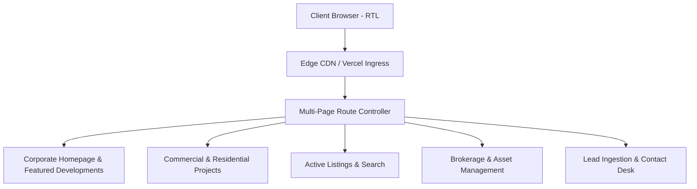

# Dar Al-Itqan Real Estate Web Platform (دار الإتقان للعقارات)

Bilingual Arabic right-to-left (RTL) property catalog, corporate showcase, and real estate services web portal.



## Architectural Overview

Dar Al-Itqan is built to provide an institutional-grade digital presence for property developers and real estate brokerages in the Gulf region. It enforces standard Arabic typography hierarchy using Google Fonts Cairo and native Right-to-Left document structure.

### Platform Modules

- **Project Showcase (`projects.html`)**: Commercial and residential architectural development portfolios with structured specifications.
- **Properties Directory (`properties.html`)**: Filterable real estate catalog with pricing, zoning, and location metadata.
- **Corporate Services (`services.html`)**: Valuation, facility management, and investment advisory service overviews.
- **Editorial Hub (`blog.html`)**: Market analysis articles and regulatory updates for prospective investors.
- **Direct Lead Intake (`contact.html`)**: Unified inquiries desk linking telephone dispatch and property consultation requests.

## Technology Stack

- **Markup**: Semantic HTML5 with native `dir="rtl"` language formatting
- **Styling**: Modular CSS3 with custom variables, Flexbox layouts, and CSS Grid
- **Typography**: Cairo typeface (Google Fonts) with full Arabic glyph support
- **Icons**: FontAwesome 6 icon library

## Local Development

```bash
# Serve locally using any static web server
npx serve .
```
